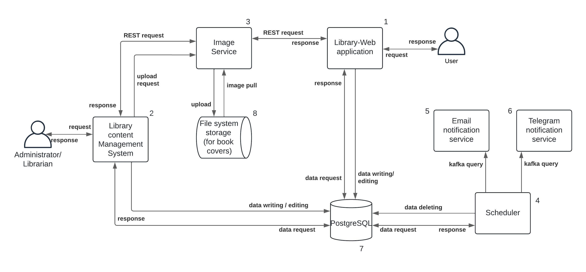

# Library Web Portal
Library Web Portal - это учебынй проект, созданный в целях освоения новых для автора технологий и инструментов разработки.

# Содержание
- [Использованные технологии и инструменты](#использованные-технологии-и-инструменты)
- [Архитектура и модули](#архитектура-и-модули)
- [Локальный запуск (Windows)](#локальный-запуск)

# Использованные технологии и инструменты
- Java (Spring Boot, Spring data JPA)
- Сборщик Maven
- Apache Kafka
- СУБД PostgreSQL
- HTML
- Thymeleaf
- Bootstrap (JS / CSS)

# Архитектура и модули
Данный проект является многомодульным java приложением, которое автор старался написать, используя микросервисноый подход. Вследствие чего архитектура выглядит следующим обрзом.



1. [Library-Web Application](https://github.com/Mukhlisov/LibraryWeb-Portal/tree/main/library) - веб MVC приложение, к которому будет обращаться конечный пользователь со всеми запросами: регистрация, вход в аккаунт, редактирование личных данных, просмотр и заказ книг.

2. [Library content Management System](https://github.com/Mukhlisov/LibraryWeb-Portal/tree/main/manager-app) - веб MVC приложение, для администраторов и библиотекарей. Оно позволяет редактировать контент сайта посредством изменения данных о книгах, авторах и заказах в базе данных.

3. [Image Service](https://github.com/Mukhlisov/LibraryWeb-Portal/tree/main/imageService) - сервис, обеспечивающий связь хранилища изображений с внешними приложениями и сервисами. Отвечает за загрузку изображений в хранилище, предоставление изображения по запросу.

4. [Scheduler](https://github.com/Mukhlisov/LibraryWeb-Portal/tree/main/scheduler) - сервис, отвечающий за выполнение ежедневных рутинных действий: удаление просроченных заказов, отправка сообщений сервисам нотификации через брокера.

5. [Email Notification Service](https://github.com/Mukhlisov/LibraryWeb-Portal/tree/main/email-notifications) - сервис, осуществляющий отправку уведомлений-напоминаний с помощью электронной почты.

6. [Telegram Notification Service](https://github.com/Mukhlisov/LibraryWeb-Portal/tree/main/telegram-notifications) - сервис осуществляющий, отправку уведомлений-напоминаний с помощью Телеграм бота.

7. PostgreSQL - база данных, хранящая информацию о книгах, авторах, пользователях, заказах.

8. File system storage - файловое хранилище для обложек книг (обычная папка на жестком диске).

# Локальный запуск
С помощью СУБД PostgreSQL создайте базу данных (имя не имеет значения).

Все следующий настроки прописываются в .property файлах каждого из модулей.

Для модулей (1, 2, 4) в .property файле укажите все необходимые настройки соединения с базой данных. Имя БД, имя пользователя и пароль.

```properties
spring.datasource.url=jdbc:postgresql://localhost:5432/имя БД
spring.datasource.username=
spring.datasource.password=
```

Для модуля 3 необходимо указать любую директорию, куда будут сохраняться обложки книг.

```properties
#Пример
storage.dir=E:\bookCovers
```

Для модуля 5 необходимо указать хоста, имя почты и пароль для сторонних сервисов.

```properties
spring.mail.host=
spring.mail.username=
spring.mail.password=
mail.property.from-address=

#Пример для mail.ru почты
spring.mail.host=smtp.mail.ru
spring.mail.username=example@mail.ru
mail.property.from-address=example@mail.ru
spring.mail.password=tNEskNXMZg3bg0PzAPSa
```

Для модуля 6 необходимо создать телеграм бота с помощью BotFather и указать имя бота и токен, который отправит BotFather после создания бота.

```properties
telegram-bot.name=
telegram-bot.token=
```

Чтобы планировщик мог отдавать сообщения сервисам нотификации необходимо запустить Apache Kafka на localhost:9092. Проще всего развернуть брокера в docker контейнере.

Перейдите в корневую папку проекта и соберите проект с помощью Maven.

```sh
mvn clean install
```

Проект соберется в .jar архивы в папках /target, соответствующих модулей (1-6).

Теперь их можно запустить через терминал.

```sh
java -jar library-1.0.0.jar
```

Library Web Application располагается по адресу http://localhost:8080, а Library content Management System по адресу http://localhost:8081.